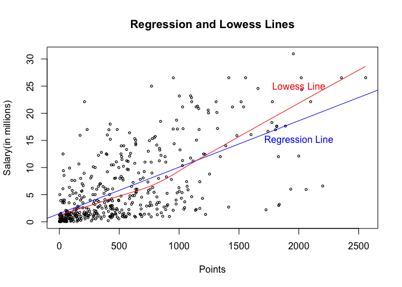
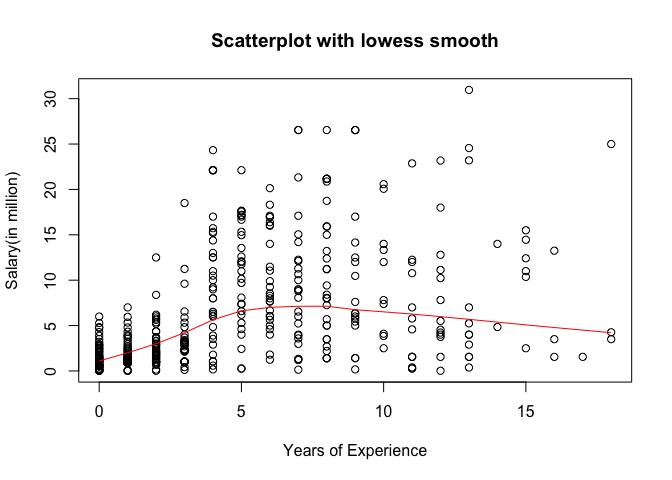
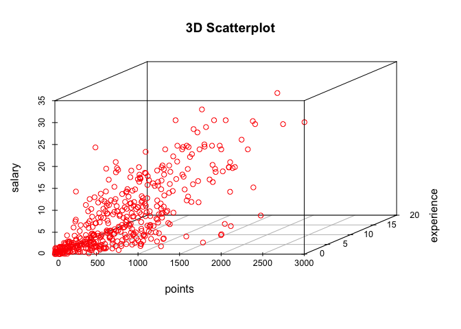
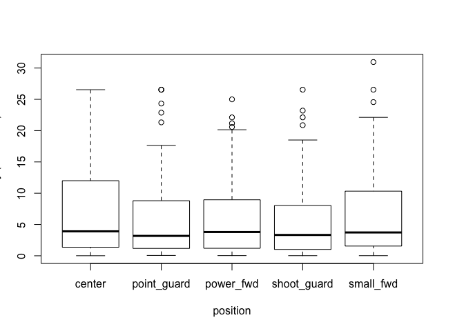

hw01-jade-wang
================

Data Processing
===============

``` r
load("/Users/Jade/stat133-hws-fall17/hw01/data/nba2017-salary-points.RData")

#salary in millions of dollars, up to 2 decimal digits
salary_m <- salary / 1000000
salary1 <- round(salary_m, digits = 2)

#integer: replace "R" by "0"
integer <- replace(experience, experience == 'R', '0')

#creating a factor of position with descriptive labels
position1 <- replace(position,position =='C','center')
position2 <- replace(position1,position1 =='SF','small_fwd')
position3 <- replace(position2,position2 =='PF','power_fwd')
position4 <- replace(position3,position3 =='SG','shoot_guard')
position5 <- replace(position4,position4 =='PG','point_guard')
position_fac <- as.factor(position5)
table(position_fac)
```

    ## position_fac
    ##      center point_guard   power_fwd shoot_guard   small_fwd 
    ##          89          85          89          95          83

Scatterplot of points and salary
================================

``` r
plot(x = points, y = salary1, cex = 0.5, xlab = 'Points', ylab = 'Salary(in millions)', main = 'Scatterplot of Points and Salary', col='red')
```


###### As the scatterplot shows, there is somehow a positive correlation between points and salary. However, the correlation is not strong enough to give a conclusion, as there are many outliers.

Correlation between points and salary
=====================================

``` r
n <- length(points)
x_mean <- sum(points)/n
y_mean <- sum(salary1)/n
x_var <- 1/(n-1)*sum((points-x_mean)^2)
y_var <- 1/(n-1)*sum((salary1-y_mean)^2)
x_sd <- sqrt(x_var)
y_sd <- sqrt(y_var)
xy_cov <- 1/(n-1)*sum((points-x_mean)*(salary1-y_mean))
xy_cor <- xy_cov/(x_sd*y_sd)
xy_cor
```

    ## [1] 0.6367296

Simple Linear Regression
========================

``` r
b1 <- xy_cor*y_sd/x_sd
b1
```

    ## [1] 0.008557567

``` r
b0 <- y_mean-b1*x_mean
b0
```

    ## [1] 1.509077

``` r
y_hat <- b0 + b1*points
summary(y_hat)
```

    ##    Min. 1st Qu.  Median    Mean 3rd Qu.    Max. 
    ##   1.509   2.844   5.206   6.187   8.184  23.400

##### Linear regression function

*Y* = 1.509077 + +0.008557567 \* *X*

-   We can consider b0 as the base salary if a player earns no point.
-   b1 can be considered as an increase rate in salary for every one extra point earned.

``` r
# If X=0 points, salary (in millions $) is
b0 + b1*0
```

    ## [1] 1.509077

``` r
# If X=100 points, salary is
b0 + b1*100
```

    ## [1] 2.364833

``` r
# If X=500 points, salary is
b0 + b1*500
```

    ## [1] 5.78786

``` r
# If X=1000 points, salary is
b0 + b1*1000
```

    ## [1] 10.06664

``` r
# If X=2000 points, salary is
b0 + b1*2000
```

    ## [1] 18.62421

Plotting the regression line
============================

``` r
plot(x = points, y = salary1, cex = 0.5, xlab = 'Points', ylab = 'Salary(in millions)', main = 'Regression and Lowess Lines')
abline(a = b0 , b = b1, col = 'blue')
lines(lowess(points,salary1), col='red')
text(2000,15,'Regression Line',col = 'blue')
text(2000,25,'Lowess Line', col = 'red')
```



Regression residuals and Coefficient of Determination R^2
=========================================================

``` r
# residuals
e <- salary1 - y_hat
summary(e)
```

    ##    Min. 1st Qu.  Median    Mean 3rd Qu.    Max. 
    ## -14.190  -2.792  -1.095   0.000   2.556  18.810

``` r
# Residual Sum of Squares
RSS <- sum(e^2)
RSS
```

    ## [1] 11300.45

``` r
# Total Sum of Squares
TSS <- sum((salary1-y_mean)^2)
TSS
```

    ## [1] 19005.91

``` r
# coefficient of determination
det <- 1-RSS/TSS
det
```

    ## [1] 0.4054246

Exploring Position and Experience
=================================

``` r
# scatterplot of Experience and Salary with a lowess line
plot(x = integer, y = salary1, xlab = 'Years of Experience', ylab = 'Salary(in million)', main = 'Scatterplot with lowess smooth')
lines(lowess(integer, salary1), col = 'red')
```



``` r
# 3D-scatterplot
scatterplot3d::scatterplot3d(x=points, y=integer, z=salary1, main = '3D Scatterplot', color = 'red', xlab = 'points', ylab = 'experience', zlab = 'salary')
```



``` r
# conditional boxplot of Salary in terms of Position
data1 <- data.frame(
  c1 = position_fac,
  c2 = salary1)
boxplot(salary1~position_fac, data = data1, ylab = "salary (in millions)",  xlab = "position")
```



##### In the boxplot, it shows that:

       + each position has similiar median. 
       + position 'point_fwd','point_guard'and 'shoot_guard' have similar IQR.
       + position 'center' has no outliers and the highest maximum.
       + position 'point guard' has the lowest maximum but many outliers.

-   From the scatterplots, we can conclude that experience is not related with salary, as there is no strong positive correlation between these two variables.
-   From the boxplot, since every position has a similar median and no great difference in IQR, we can conclude that there is no strong relation between position and salary.

Comments and Reflection
=======================

-   I have to admit, I took a long time to finish this homework (~5 hrs), as it's my first time using r to process data on my own.
-   It was hard for me to add regression line and lowess line into the scatterplot, as well as 3D-scatterplot.
-   I searched online for tuturial and tried for a couple times. Finally, I solved it! I feel so excited about it!
-   What still confuses me is that how to use inline code to write equations and how to write symbol for mean, like bar-x. Should it be typed in white or grey areas?
