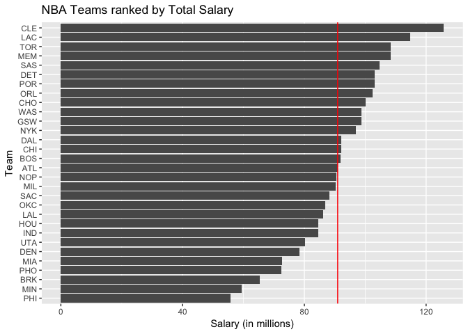
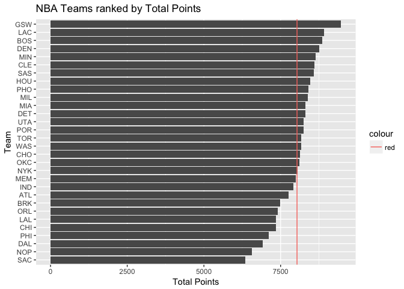
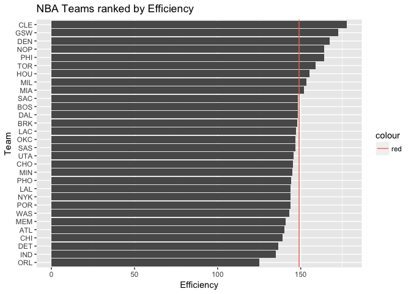
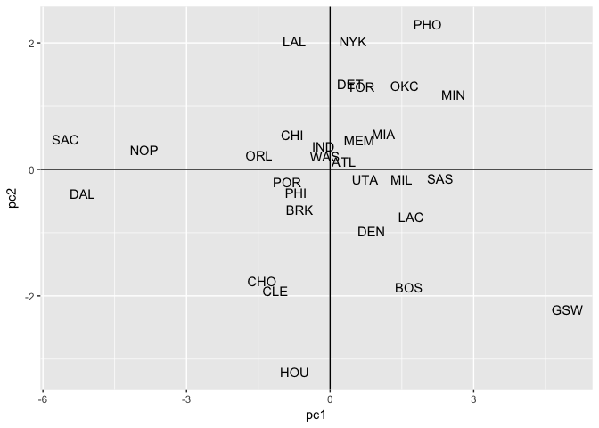
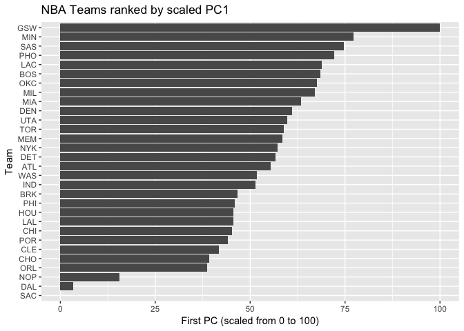

hw03-jade-wang
================

``` r
library(dplyr)
```

    ## Warning: package 'dplyr' was built under R version 3.3.2

    ## 
    ## Attaching package: 'dplyr'

    ## The following objects are masked from 'package:stats':
    ## 
    ##     filter, lag

    ## The following objects are masked from 'package:base':
    ## 
    ##     intersect, setdiff, setequal, union

``` r
library(readr)
```

    ## Warning: package 'readr' was built under R version 3.3.2

``` r
library(ggplot2)
```

    ## Warning: package 'ggplot2' was built under R version 3.3.2

``` r
dat <- read.csv('/Users/Jade/stat133-hws-fall17/hw03/data/nba2017-teams.csv')
```

``` r
# basic ranking by salary in decreasing order

dat_by_salary <- dat %>%
  select(team, salary) %>%
  arrange(desc(salary)) 
```

    ## Warning: package 'bindrcpp' was built under R version 3.3.2

``` r
ggplot(data = dat_by_salary,
       aes(x = reorder(team, salary, sum), y = salary)) +
  labs(title = 'NBA Teams ranked by Total Salary',
         x = 'Team', y = 'Salary (in millions)') +
  geom_bar(stat = 'identity') +
  coord_flip() +
  geom_hline(aes(yintercept = mean(salary)), col = 'red')
```



``` r
# ranking by total points
dat_by_TP <- dat %>%
  select(team, points) %>%
  arrange(desc(points)) 
  

ggplot(data = dat_by_TP, 
       aes(x = reorder(team, points, sum), y = points)) +
  labs(title = 'NBA Teams ranked by Total Points',
         x = 'Team', y = 'Total Points') +
  geom_bar(stat = 'identity') +
  coord_flip() +
  geom_hline(aes(yintercept = mean(points), col = 'red'))
```



``` r
# ranking by efficiency
dat_by_EFF <- dat %>%
  select(team, efficiency) %>%
  arrange(desc(efficiency)) 
  

ggplot(data = dat_by_EFF, 
       aes(x = reorder(team, efficiency, sum), y = efficiency)) +
  labs(title = 'NBA Teams ranked by Efficiency',
         x = 'Team', y = 'Efficiency') +
  geom_bar(stat = 'identity') +
  coord_flip() +
  geom_hline(aes(yintercept = mean(dat$efficiency), col = 'red'))
```

 \#\#\# From the above three different ranking methods, I find that the top 2 teams in any ranking system would be within three teams: CLE, GSW and LAL. However, the other teams have quite different ranks in each system. Therefore, I think that the strongest teams uauslly remain as the top ones regardless of which ranking system used.

``` r
# Principal Components Analysis (PCA)

dat <- read.csv('/Users/Jade/stat133-hws-fall17/hw03/data/nba2017-teams.csv')

list1 <- dat %>% select(
  points3_made,
  points2_made,
  points1_made,
  off_rebounds,
  def_rebounds,
  assists,
  steals,
  blocks,
  turnovers,
  fouls)

pca <- prcomp(list1, scale. = TRUE)

#eigenvalues
eigs <- data.frame(
  eigenvalue = pca$sdev^2,
  prop = round(pca$sdev^2/sum(pca$sdev^2) , 4),
  cumprop = round(cumsum(pca$sdev^2/sum(pca$sdev^2)), 4)
)

eigs
```

    ##    eigenvalue   prop cumprop
    ## 1  4.69588631 0.4696  0.4696
    ## 2  1.70201009 0.1702  0.6398
    ## 3  0.97952464 0.0980  0.7377
    ## 4  0.77171938 0.0772  0.8149
    ## 5  0.53408824 0.0534  0.8683
    ## 6  0.47801622 0.0478  0.9161
    ## 7  0.38220374 0.0382  0.9543
    ## 8  0.26026243 0.0260  0.9804
    ## 9  0.13359274 0.0134  0.9937
    ## 10 0.06269622 0.0063  1.0000

``` r
df1 <- data.frame(
  pc1 = pca$x[ ,1],
  pc2 = pca$x[ ,2]
)

ggplot(df1, aes(x = pc1, y = pc2)) +
  geom_text(aes(label = dat$team)) +
  geom_hline( yintercept = 0) +
  geom_vline( xintercept = 0)
```



``` r
# Index based on PC1
library(scales)
```

    ## Warning: package 'scales' was built under R version 3.3.2

    ## 
    ## Attaching package: 'scales'

    ## The following object is masked from 'package:readr':
    ## 
    ##     col_factor

``` r
pc1 <- pca$x[,1]

z1 <- rescale(pc1, to = c(0,100))

s1 <- 100 * (z1 - min(z1))/(max(z1) - min(z1))

df2 <- data.frame(dat$team , s1)

ggplot(data = df2, 
       aes(x = reorder(dat$team, s1, sum), y = s1)) +
  labs(title = 'NBA Teams ranked by scaled PC1',
         x = 'Team', y = 'First PC (scaled from 0 to 100)') +
  geom_bar(stat = 'identity') +
  coord_flip()
```



Comments and Reflections
========================

    +   I find dealing with different types of data is difficult for me. 
    I have to pay attention to the type of data I'm processing with, or I would not get the results I want.
    +   I find, as long as I collect the correct data frame, 
    plotting becomes much more easier than I first used rmd.
    +   I spent around 6 + hours on this homework,
    but most of the time I was stuck rather than writing codes.
    +   The most time consuming part is re-organizing data base 
    and creating new data frames. Plotting was pretty interesting though.
