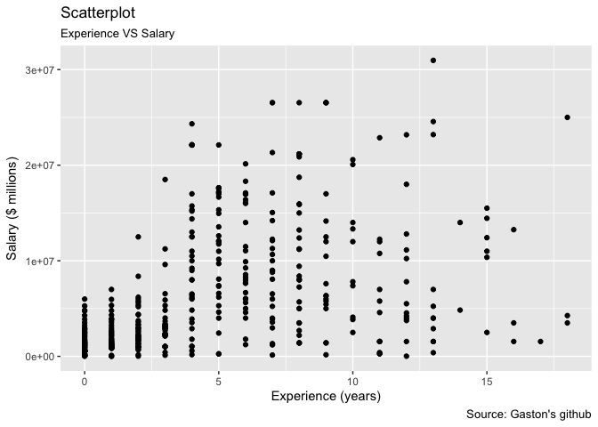
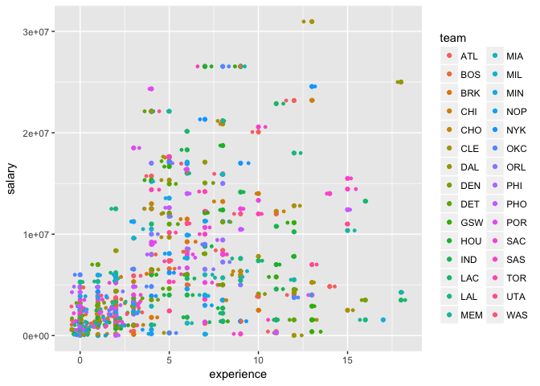
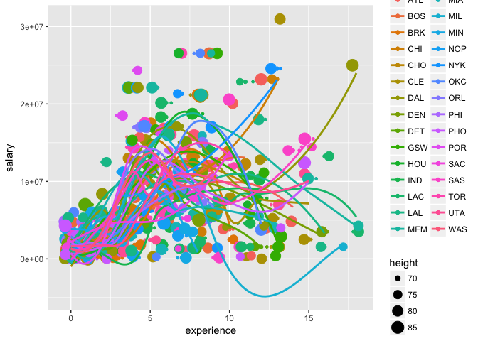
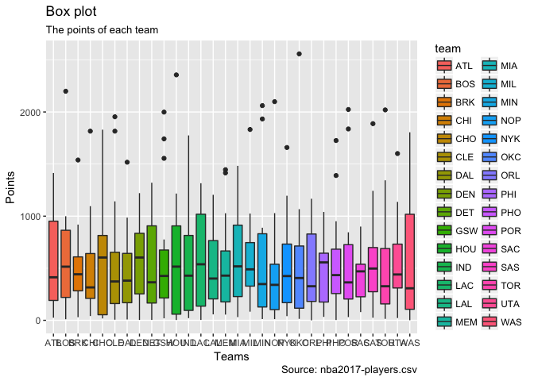

Post 01
================

Introduction
============

-   The idea of "ggplot2" is introduced as as a more advanced plotting method in addition to the base R pakage. The “gg” in ggplot2 stands for the Grammar of Graphics, a comprehensive theory of graphics by Lee Wilkinson which he described in his book by the same name.

-   In Wilkinson's book, *The Grammar of Graphics*, he showed how we could describe plots not as discrete types like bar plot or pie chart, but using a “grammar” that would work not only for plots we commonly use but for almost any conceivable graphic. From this perspective, a pie chart is just a bar chart with a circular (polar) coordinate system replacing the rectangular Cartesian coordinate system.

Background
==========

-   ### Here are some basic terminologies we've learned so far about ggplot.

    -   **ggplot** - The main function where you specify the dataset and variables to plot.
    -   **geoms** - The geomatric objects
        -   *Examples*: geom\_point(), geom\_bar(), geom\_density(), geom\_line(), etc.
    -   **aes** - The aesthetics
        -   *Examples*: shape, transparency(alpha), color, fill, linetype, etc.
    -   **scales** - Defines how the data will be plotted.
        -   *Examples*: continuous, discrete, log, etc.
-   ### Examples: assembling the ggplot

    -   ### The dataset of 2017 NBA players.

``` r
players <- read.csv('/Users/Jade/stat133-hws-fall17/post01/data/nba2017-players.csv')

head(players, 3)
```

    ##          player team position height weight age experience
    ## 1    Al Horford  BOS        C     82    245  30          9
    ## 2  Amir Johnson  BOS       PF     81    240  29         11
    ## 3 Avery Bradley  BOS       SG     74    180  26          6
    ##                         college   salary games minutes points points3
    ## 1         University of Florida 26540100    68    2193    952      86
    ## 2                               12000000    80    1608    520      27
    ## 3 University of Texas at Austin  8269663    55    1835    894     108
    ##   points2 points1
    ## 1     293     108
    ## 2     186      67
    ## 3     251      68

-   ### Basic Scatterplot

``` r
library('ggplot2')
```

    ## Warning: package 'ggplot2' was built under R version 3.3.2

``` r
myplot <- ggplot(data = players, aes(x = experience, y = salary)) + geom_point()

myplot
```


-   ### Adding some labels

``` r
myplot <- myplot + labs(subtitle="Experience VS Salary", 
       y="Salary ($ millions)", 
       x="Experience (years)", 
       title="Scatterplot", 
       caption = "Source: Gaston's github")

myplot
```



-   ### Adding some colors

We can assign different colors to each NBA players by their teams.

``` r
myplot <- ggplot(data = players, aes(x = experience, y = salary, color = team)) + geom_point()

myplot
```


-   ### Adding smooth line

``` r
ggplot(data = players, aes(x = experience, y = salary)) + geom_point() + geom_smooth(method= 'loess', se = F) 
```


-   ### Jitter Plot

We can make a jitter plot with jitter\_geom(). As the name suggests, the overlapping points are randomly jittered around its original position based on a threshold controlled by the width argument.

``` r
myplot <- myplot + geom_jitter(width = .5, size=1)

myplot
```



-   ### Bubble Plot

While scatterplot lets you compare the relationship between 2 continuous variables, bubble chart serves well if you want to understand relationship within the underlying groups based on:

    +  A Categorical variable (by changing the color) and
    +  Another continuous variable (by changing the size of points).

In simpler words, bubble charts are more suitable if you have 4-Dimensional data where two of them are numeric (X and Y) and one other categorical (color) and another numeric variable (size).

The bubble chart clearly distinguishes the range of displ between the manufacturers and how the slope of lines-of-best-fit varies, providing a better visual comparison between the groups.

``` r
myplot + geom_jitter(aes(col=team, size=height)) + 
  geom_smooth(aes(col=team), method="loess", se=F)
```

    ## Warning in simpleLoess(y, x, w, span, degree = degree, parametric =
    ## parametric, : pseudoinverse used at 3

    ## Warning in simpleLoess(y, x, w, span, degree = degree, parametric =
    ## parametric, : neighborhood radius 2

    ## Warning in simpleLoess(y, x, w, span, degree = degree, parametric =
    ## parametric, : reciprocal condition number 0

    ## Warning in simpleLoess(y, x, w, span, degree = degree, parametric =
    ## parametric, : pseudoinverse used at 4

    ## Warning in simpleLoess(y, x, w, span, degree = degree, parametric =
    ## parametric, : neighborhood radius 2

    ## Warning in simpleLoess(y, x, w, span, degree = degree, parametric =
    ## parametric, : reciprocal condition number 7.2305e-17



-   ### Diverging Barplot

Diverging Bars is a bar chart that can handle both negative and positive values. This can be implemented by a smart tweak with geom\_bar().

In order to make a bar chart create bars instead of histogram, we need to do two things. 1. Set stat=identity 2. Provide both x and y inside aes() where, x is either character or factor and y is numeric.

In below example, since we only get positive variables, we can only show one-side barplot, but still we can show prensent each team at different colors.

``` r
1
```

    ## [1] 1

``` r
ggplot(players, aes(y= points, x=team, label= team)) + 
  geom_bar(stat='identity', aes(fill=team), width=.5)  + 
  labs(subtitle="Total points and teams'", 
       title= "Diverging Bars") + 
  coord_flip()
```


-   ### Diverging Lollipop Chart

Lollipop chart conveys the same information as bar chart and diverging bar. Except that it looks more modern.

``` r
ggplot(players, aes(y= points, x=team, label= team)) + 
  geom_point(stat='identity', aes(fill=team), width=.5)   + 
  geom_segment(aes(y = 0, 
                   x = team,
                   xend = team,
                   yend = points,
               color = team)) +
   labs(subtitle="Points and Teams'", 
       title= "Diverging Bars") +
  coord_flip()
```

    ## Warning: Ignoring unknown parameters: width


-   ### Histogram

Histogram on a continuous variable can be accomplished using either geom\_bar() or geom\_histogram(). When using geom\_histogram(), you can control the number of bars using the *bins* or *binwidth* option.

``` r
ggplot(players, aes(points)) + 
  geom_histogram(aes(fill = position), binwidth = 80) + 
  labs(subtitle="Points and Teams", 
       title= "Histogram")
```


-   ### Boxplot

Box plot is an excellent tool to study the distribution. It can also show the distributions within multiple groups, along with the median, range and outliers if any.

The dark line inside the box represents the median. The top of box is 75% percentile and bottom of box is 25% percentile. The end points of the lines is at a distance of 1.5\*IQR, where IQR or Inter Quartile Range is the distance between 25th and 75th percentiles. The points outside the whiskers are marked as dots and are normally considered as extreme points.

Setting *varwidth=T* adjusts the width of the boxes to be proportional to the number of observation it contains.

``` r
ggplot(players, aes(team, points, fill = team)) + 
  geom_boxplot(varwidth=T) + 
    labs(title="Box plot", 
         subtitle="The points of each team",
         caption="Source: nba2017-players.csv",
         x="Teams",
         y="Points")
```



Summary
-------

-   **Basic Structure**: ggplot(data, aes(x,y)) + geom

-   **Adding labels**: ggtitle() labs(title, subtitle, x, y)

-   **Adding aesthetics**: aes(color, alpha, linetype)

-   **Adding smooth lines**: ggplot + geom\_smooth()

-   **Jitter plot**: ggplot + geom\_jitter()

-   **Bubble plot**: geom\_smooth() + geom\_jitter()

-   **Barplot**: geom\_bar()

-   **Lollipop Chart**: geom\_point() + geom\_segment()

-   **Histogram**: geom\_histogram()

-   **Boxplot**: geom\_boxplot()

Conclusions
-----------

-   **Base R graphic**
-   Ugly, laborious, and verbose.

-   **ggplot**
-   Follows a grammar, just like any other languages.
-   The grammar defines basic components in a plot.
-   Grammar of graphics is originally coined by Lee Wilkinson.

-   While R’s traditional graphics offers a nice set of plots, some of them require a lot of work. Viewing the same plot for different groups in our data is particularly difficult.

-   In contrast, the ggplot2 package is extremely flexible and repeating plots for groups is quite easy.

References
==========

1.  "Data visualization with R & ggplot2"", by Karthik Ram. <https://github.com/ucb-stat133/stat133-fall-2017/blob/master/slides/14-ggplot-lecture.pdf>

2.  "The Grammar of Graphics & ggplot2", by Gaston Sachez. <https://docs.google.com/presentation/d/e/2PACX-1vTGKt6asJIPfSXbuO5Jn1qtAOTQbOcWmE0TVXr67z7DOkOUHPj43Vi1Q7hqw-xYTy3pzD2985H9It0T/pub?start=false&loop=false&delayms=3000&slide=id.gd30d76405_0_29>

3.  The dataset 'players', from "nba2017-players.csv" in github. <https://github.com/ucb-stat133/stat133-fall-2017/blob/master/data/nba2017-players.csv>

4.  The 'ggplot2' cheatsheet from github. <https://github.com/ucb-stat133/stat133-fall-2017/blob/master/cheat-sheets/ggplot2-cheatsheet-2.1.pdf>

5.  "Lab 5: First contact with dplyr and ggplot2" from github. <https://github.com/ucb-stat133/stat133-fall-2017/blob/master/labs/lab05-dplyr-ggplot-basics.md>

6.  "Lab 6: More dplyr, ggplot2, and files' stuff" from github. <https://github.com/ucb-stat133/stat133-fall-2017/blob/master/labs/lab06-more-dplyr-ggplot.md>

7.  "Examples using ggplot2" <http://r4stats.com/examples/graphics-ggplot2/>
